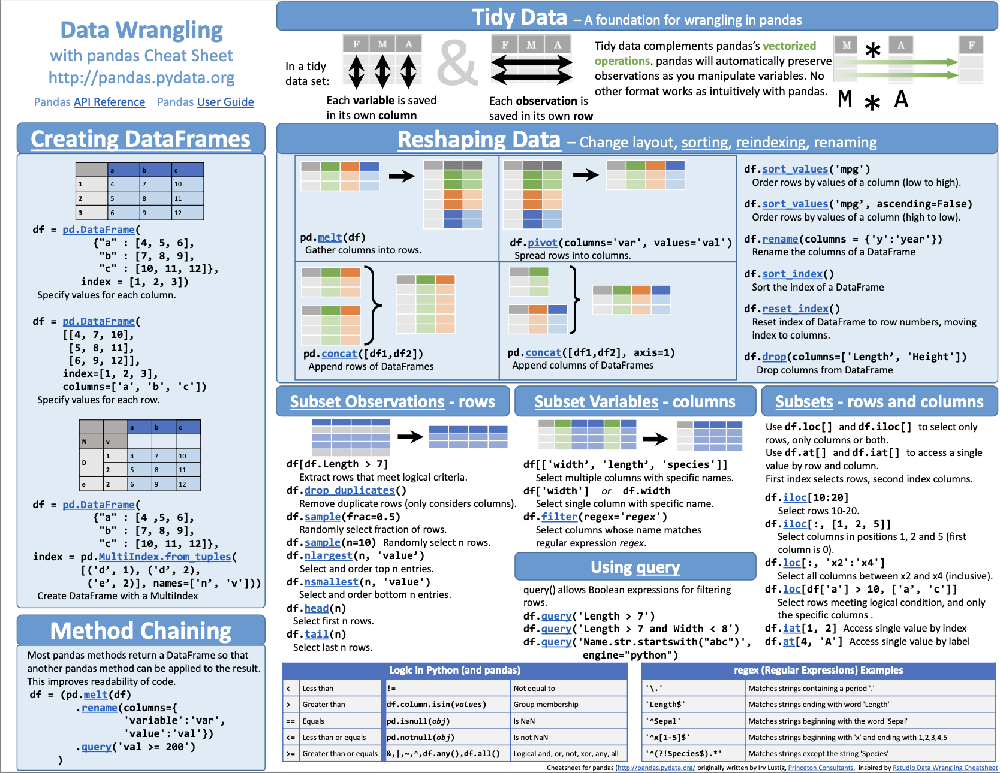
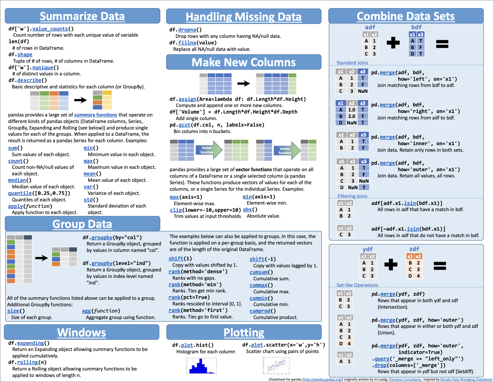

- [1](#1)
  - [DataFrame](#dataframe)
    - [make dataframe](#make-dataframe)
    - [read tabular data](#read-tabular-data)
    - [excel](#excel)
    - [add \& set values of new column](#add--set-values-of-new-column)
  - [select rows \& columns](#select-rows--columns)
    - [select columns](#select-columns)
    - [boolean indexing](#boolean-indexing)
    - [loc](#loc)
    - [조건 slicing in specific column](#조건-slicing-in-specific-column)
    - [iloc](#iloc)
  - [plot](#plot)
    - [simple plot](#simple-plot)
  - [combine tables](#combine-tables)
    - [.concatenate](#concatenate)
    - [.join](#join)
  - [sort](#sort)
  - [CheatSheet](#cheatsheet)
- [2](#2)
  - [Class, Attribute, Constructor, Function](#class-attribute-constructor-function)
  - [상속, 다형성](#상속-다형성)
    - [super().\_\_init(params)](#super__initparams)
  - [가시성](#가시성)
  - [Modules and packages](#modules-and-packages)
    - [Module](#module)
    - [Custom module](#custom-module)


# 1

## DataFrame

### make dataframe

```python
df = pd.DataFrame({"Name": ["Braund, Mr. Owen Harris", 
                            "Allen, Mr. William Henry", 
                            "Bonnell, Miss. Elizabeth",],
                   "Age": [22, 
                           35, 
                           58],
                   "Sex": ["male", 
                           "male", 
                           "female"],})
```

```python
df['Age']
df.Age
```

+ check data

```python
df.info()
df.describe()
df.dtypes
```

### read tabular data

+ 'State' as index

```python
alco2009 = pd.read_csv(path+filename, index_col="State")
```

### excel

+ df to excel

```python
titanic.to_excel("titanic.xlsx", sheet_name="passengers", index=False)
```

+ excel to df

```python
titanic2 = pd.read_excel("titanic.xlsx", sheet_name="passengers")
```

### add & set values of new column

+ broadcasting

```python
alco2009["Total"] = 0
```

## select rows & columns

### select columns

+ as DataFrame not Series

```python
age_sex = titanic[["Age", "Sex"]]
```

### boolean indexing

```python
above_35 = titanic[titanic["Age"] > 35]
```

### loc

+ df = df.loc[조건, 열]

```python
adult_names = titanic.loc[titanic["Age"] > 35, "Name"]
```

### 조건 slicing in specific column

+ df = df.열[조건]

```python
adult_names = titanic.Name[titanic.Age > 35]
```

+ multiple conditions
  + (C1) & (C2)

```python
survived_female = titanic[(titanic.Survived == 1) & (titanic.Sex == 'female')]
```

### iloc

+ slice by index number
  + .iloc[행, 열]

```python
sliced_1 = titanic.iloc[3:10, 0:2]
```

```python
sliced_2 = titanic.iloc[[0, 2, 4, 6, 8], [0, 2, 4]]
```

## plot

### simple plot

```python
air_quality.plot()
```

## combine tables

### .concatenate


+ 행이 많아짐
+ 세로로 이어붙이기 (밑에)

```python
air_quality = pd.concat([air_quality_pm25, air_quality_no2], axis=0)
```

### .join


+ 열이 많아짐
+ 가로로 이어붙이기 (옆에)

```python
air_quality = pd.merge(air_quality_pm25, air_quality_no2, on="date.utc")
```

## sort

```python
air_quality = air_quality.sort_values("date.utc")
```

## CheatSheet




---

# 2

## Class, Attribute, Constructor, Function

```python
class Cookie:
  # foodtype = 'Yummy!'  # attribute
  def __init__(self, taste='Yummy!'):
    self.taste = taste

  def set_taste(self, taste):
    self.taste = taste

a = Cookie()
b = Cookie('Bad!')
b.set_taste('Hmm... not bod.')
```

## 상속, 다형성

### super().__init(params)

```python
class Player():
    def __init__(self, name, back_number):
        self.name = name
        self.back_number = back_number
        
    def print_stat(self):
        print(f"This is {self.__class__.__name__} Class")
        print(f"Player Name: {self.name}")
        print(f"Back Number: {self.back_number}")
        
        
class SoccerPlayer(Player):
    def __init__(self, name, back_number, position):
        super().__init__(name, back_number)
        self.position = position
        
    def print_stat(self):
        super().print_stat()
        print(f"Position: {self.position}")
        
        
class BaseballPlayer(Player):
    def __init__(self, name, back_number, position, avg):
        super().__init__(name, back_number)
        self.position = position
        self.avg = avg
        
    def print_stat(self):
        super().print_stat()
        print(f"Position: {self.position}")
        print(f"Batting Average: {self.avg}")
```

## 가시성

## Modules and packages

### Module

### Custom module

+ from <package> import *
+ from <package> import <module>
+ import <module> (as <abbr>)